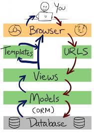

# Oficina Django

# 💻 Repositório no GitHub

[GitHub - oficina-django-presentation](https://github.com/oficina-django-presentation)

## Preparação do Ambiente

- [x]  Instalar Python
    
    📥 [Download](https://www.python.org/downloads/)
    
- [x]  Instalar PyCharm
    
    📥 [Download](https://www.jetbrains.com/pt-br/pycharm/download/)
    
- [x]  Instalar DBeaver
    
    📥 [Download](https://dbeaver.io/download/)
    

🔗 [Instruções de configuração - Windows](https://www.treinaweb.com.br/blog/configurando-ambiente-de-desenvolvimento-django-no-windows/)

🔗 [Instruções de configuração - Linux](https://www.treinaweb.com.br/blog/configurando-ambiente-de-desenvolvimento-django-no-linux/)

🔗 [Instruções de configuração - macOS](https://www.treinaweb.com.br/blog/configurando-ambiente-de-desenvolvimento-django-no-macos/)

## Criação do Projeto

- [x]  Criando o diretório oficina_django
    
    ```bash
    **$ mkdir oficina_django
    $ cd oficina_django**
    ```
    
- [x]  Criar Ambiente Virtual
    
    ```bash
    **$ python -m venv venv**
    ```
    
- [x]  Ativar o Ambiente Virtual
    
    ```bash
    **$ .\venv\Scripts\activate**
    ```
    

🔗 [Instruções de criação do Ambiente Virtual](https://docs.python.org/3/library/venv.html)

---

- [x]  Instalação do Django
    
    ```bash
    **$ pip install Django**
    ```
    
- [x]  Criando o projeto no diretório oficina_django
    
    ```bash
    **$ django-admin startproject oficina_django**
    ```
    
- [x]  Criando o projeto no diretório atual
    
    ```bash
    **$ django-admin startproject oficina_django .**
    ```
    

Mostrar os arquivos default de um Projeto Django

- [x]  **oficina_django/manage.py** - utilitário de linha de comando para interação com o projeto Django
- [x]  **oficina_django/__init__.py** - um arquivo em branco que diz ao Python para tratar o diretório como um módulo
- [x]  **oficina_django/asgi.py -** interface assíncrona para web servers
- [x]  **oficina_django/settings.py** - configurações do projeto Django
- [x]  **oficina_django/urls.py** - declaração das rotas do projeto Django. Cada rota é mapeada para uma view
- [x]  **oficina_django/wsgi.py** - interface para web servers
- [x]  Executar o projeto
    
    ```bash
    **$ python manage.py runserver**
    ```
    

## Criação da Aplicação blog

- [x]  Criando a aplicação blog
    
    ```bash
    **$ python manage.py startapp blog**
    ```
    

Mostrar os arquivos default de uma Aplicação Django

- [x]  **blog/migrations** - Diretório que contém as migrações do banco de dados. Migrações permitem o Django rastrear mudanças nos Models e sincronizar o Banco de Dados
- [x]  **blog/admin.py** - Permitir adicionar os models para serem manipulados no Painel do Django Admin
- [x]  **blog/apps.py** - Arquivo de configurações da Aplicação
- [x]  **blog/models.py** - Define as Classes que serão mapeadas para Tabelas no Banco de Dados pelo ORM do Django
- [x]  **blog/tests.py** - Onde os Testes da Aplicação podem ser adicionados
- [x]  **blog/views.py** - Onde a Lógica da Aplicação é implementada. Cada view recebe uma requisição HTTP, a processa e retorna uma resposta

---

- [x]  Registrar a Aplicação no settings.py
    
    **oficina_django/settings.py**
    
    ```python
    INSTALLED_APPS = [
        'django.contrib.admin',
        'django.contrib.auth',
        'django.contrib.contenttypes',
        'django.contrib.sessions',
        'django.contrib.messages',
        'django.contrib.staticfiles',
        'blog',
    ]
    ```
    

## O Padrão MVT - Model View Template



### Exemplo - Hello World

- [x]  Mapear as rotas da aplicação **blog** no projeto **oficina_django**
    
    **oficina_django/urls.py**
    
    ```python
    from django.contrib import admin
    from django.urls import path, include
    
    urlpatterns = [
        path('admin/', admin.site.urls),
        path('blog/', include('blog.urls')),
    ]
    ```
    
- [x]  Criar arquivo **urls.py** na aplicação blog
    
    ```python
    from django.http import HttpResponse
    
    def hello_world(request):
        return HttpResponse('Hello, world!')
    ```
    

## CRUD - Categoria

### Inclusão de Categoria

- [x]  Criar Model Categoria
    
    **blog/models.py**
    
    ```python
    from django.db import models
    
    class Categoria(models.Model):
        nome = models.CharField(max_length=20)
    ```
    
- [x]  Criar a migração do Model Categoria
    
    ```bash
    **$ python manage.py makemigrations blog**
    ```
    
- [x]  Fazer a migração para o Banco de Dados
    
    ```bash
    **$ python manage.py migrate blog**
    ```
    
- [x]  Criar arquivo **forms.py** no diretório blog
    
    **blog/forms.py**
    
    ```python
    from django import forms
    
    from blog.models import Categoria
    
    class CategoriaForm(forms.ModelForm):
        class Meta:
            model = Categoria
            fields = ['nome', ]
    
    ```
    
- [x]  Criar **view** para inserir Categoria
    
    **blog/views.py**
    
    ```python
    from django.shortcuts import render
    
    from blog.forms import CategoriaForm
    
    def inserir_categoria(request):
        form = CategoriaForm()
        context = {
            'form': form
        }
        return render(request, 'inserir_categoria.html', context)
    
    ```
    
- [x]  Criar **template** para inserir categoria
    - [x]  Criar diretório **templates** dentro do diretório **blog**
    - [x]  Criar o arquivo **inserir_categoria.html** dentro do diretório **blog/templates**
        
        **blog/templates/inserir_categoria.html**
        
        ```html
        <!doctype html>
        <html lang="en">
        <head>
            <meta charset="UTF-8">
            <meta name="viewport"
                  content="width=device-width, user-scalable=no, initial-scale=1.0, maximum-scale=1.0, minimum-scale=1.0">
            <meta http-equiv="X-UA-Compatible" content="ie=edge">
            <title>Inserir Categoria</title>
        
            <link rel="stylesheet" href="https://maxcdn.bootstrapcdn.com/bootstrap/4.0.0/css/bootstrap.min.css"
                  integrity="sha384-Gn5384xqQ1aoWXA+058RXPxPg6fy4IWvTNh0E263XmFcJlSAwiGgFAW/dAiS6JXm" crossorigin="anonymous">
        </head>
        <body style="background-color: #eee;">
        
        <div class="container">
            <form class="d-flex flex-column align-items-center p-5 my-5 bg-light">
                <h2 class="text-center">Inserir Categoria</h2>
                
                <div class="form-group pt-4">
                    <label class="control-label">Nome:</label>
                    {{ form.nome }}
        						<div class="text-danger">{{ form.nome.errors|striptags }}</div>
                </div>
        
                <div class="d-flex justify-content-center mt-2">
                    <a class="btn btn-secondary mx-2" href="#">Cancelar</a>
                    <button class="btn btn-success" type="submit">Salvar</button>
                </div>
            </form>
        </div>
        <script src="https://code.jquery.com/jquery-3.2.1.slim.min.js"
                integrity="sha384-KJ3o2DKtIkvYIK3UENzmM7KCkRr/rE9/Qpg6aAZGJwFDMVNA/GpGFF93hXpG5KkN"
                crossorigin="anonymous"></script>
        <script src="https://cdnjs.cloudflare.com/ajax/libs/popper.js/1.12.9/umd/popper.min.js"
                integrity="sha384-ApNbgh9B+Y1QKtv3Rn7W3mgPxhU9K/ScQsAP7hUibX39j7fakFPskvXusvfa0b4Q"
                crossorigin="anonymous"></script>
        <script src="https://maxcdn.bootstrapcdn.com/bootstrap/4.0.0/js/bootstrap.min.js"
                integrity="sha384-JZR6Spejh4U02d8jOt6vLEHfe/JQGiRRSQQxSfFWpi1MquVdAyjUar5+76PVCmYl"
                crossorigin="anonymous"></script>
        </body>
        </html>
        ```
        
- [x]  Criar **url** para chamar a view que insere categoria
    
    **blog/urls.py**
    
    ```python
    from django.urls import path
    
    from blog.views import inserir_categoria
    
    urlpatterns = [
        path('inserir_categoria/', inserir_categoria),
    ]
    
    ```
    

**Nada acontece! É necessário informar o método post no formulário e tratar a requisição no arquivo views.py**

- [x]  Adicionar nome à rota que insere categoria, atualizando o arquivo **urls.py**, para que esta seja chamada pelo template **inserir_categoria.html** ao enviar o formulário
    
    **blog/urls.py**
    
    ```python
    from django.urls import path
    
    from blog.views import inserir_categoria
    
    urlpatterns = [
        path('inserir_categoria/', inserir_categoria, name='inserir_categoria'),
    ]
    ```
    
- [x]  Atualizar o arquivo **inserir_categoria.html**, adicionando o método e a action no formulário
    
    **blog/templates/inserir_categoria.html**
    
    ```html
    <!doctype html>
    <html lang="en">
    <head>
        <meta charset="UTF-8">
        <meta name="viewport"
              content="width=device-width, user-scalable=no, initial-scale=1.0, maximum-scale=1.0, minimum-scale=1.0">
        <meta http-equiv="X-UA-Compatible" content="ie=edge">
        <title>Inserir Categoria</title>
    
        <link rel="stylesheet" href="https://maxcdn.bootstrapcdn.com/bootstrap/4.0.0/css/bootstrap.min.css"
              integrity="sha384-Gn5384xqQ1aoWXA+058RXPxPg6fy4IWvTNh0E263XmFcJlSAwiGgFAW/dAiS6JXm" crossorigin="anonymous">
    </head>
    <body style="background-color: #eee;">
    
    <div class="container">
        <form method="post" action=""
              class="d-flex flex-column align-items-center p-5 my-5 bg-light">
            <h2 class="text-center">Inserir Categoria</h2>
            
            <div class="form-group pt-4">
                <label class="control-label">Nome:</label>
                {{ form.nome }}
    						<div class="text-danger">{{ form.nome.errors|striptags }}</div>
            </div>
    
            <div class="d-flex justify-content-center mt-2">
                <a class="btn btn-secondary mx-2" href="#">Cancelar</a>
                <button class="btn btn-success" type="submit">Salvar</button>
            </div>
        </form>
    </div>
    <script src="https://code.jquery.com/jquery-3.2.1.slim.min.js"
            integrity="sha384-KJ3o2DKtIkvYIK3UENzmM7KCkRr/rE9/Qpg6aAZGJwFDMVNA/GpGFF93hXpG5KkN"
            crossorigin="anonymous"></script>
    <script src="https://cdnjs.cloudflare.com/ajax/libs/popper.js/1.12.9/umd/popper.min.js"
            integrity="sha384-ApNbgh9B+Y1QKtv3Rn7W3mgPxhU9K/ScQsAP7hUibX39j7fakFPskvXusvfa0b4Q"
            crossorigin="anonymous"></script>
    <script src="https://maxcdn.bootstrapcdn.com/bootstrap/4.0.0/js/bootstrap.min.js"
            integrity="sha384-JZR6Spejh4U02d8jOt6vLEHfe/JQGiRRSQQxSfFWpi1MquVdAyjUar5+76PVCmYl"
            crossorigin="anonymous"></script>
    </body>
    </html>
    ```
    
- [x]  Atualizar o arquivo **views.py**, tratando os dados da requisição enviada com o método POST e salvando no Banco de Dados
    
    **blog/templates/views.py**
    
    ```python
    from django.shortcuts import render
    
    from blog.forms import CategoriaForm
    from blog.models import Categoria
    
    def inserir_categoria(request):
        form = CategoriaForm()
        ifrequest.method == 'POST':
            form = CategoriaForm(request.POST)
            if form.is_valid():
                nome = form.cleaned_data['nome']
                categoria = Categoria(nome=nome)
                categoria.save()
                form = CategoriaForm()
        context = {
            'form': form
        }
        return render(request, 'inserir_categoria.html', context)
    
    ```
    

---

### Visualização de Todas as Categorias

- [x]  Criar **url** para chamar a view que mostra todas as categorias cadastradas
    
    **blog/urls.py**
    
    ```python
    from django.urls import path
    
    from blog.views import inserir_categoria, visualizar_categorias
    
    urlpatterns = [
        path('inserir_categoria/', inserir_categoria, name='inserir_categoria'),
        path('visualizar_categorias/', visualizar_categorias, name='visualizar_categorias'),
    ]
    ```
    
- [x]  Criar view que lista todas as categorias cadastradas, no arquivo **views.py**
    
    **blog/views.py**
    
    ```python
    from django.shortcuts import render
    
    from blog.forms import CategoriaForm
    from blog.models import Categoria
    
    def inserir_categoria(request):
        form = CategoriaForm()
        ifrequest.method == 'POST':
            form = CategoriaForm(request.POST)
            if form.is_valid():
                nome = form.cleaned_data['nome']
                categoria = Categoria(nome=nome)
                categoria.save()
                form = CategoriaForm()
        context = {
            'form': form
        }
        return render(request, 'inserir_categoria.html', context)
    
    def visualizar_categorias(request):
        categorias = Categoria.objects.all()
        context = {
            'categorias': categorias,
        }
        return render(request, 'visualizar_categorias.html', context)
    
    ```
    
- [x]  Criar template para mostrar as categorias
    
    **blog/templates/visualizar_categorias.html**
    
    ```python
    <!doctype html>
    <html lang="en">
    <head>
        <meta charset="UTF-8">
        <meta name="viewport"
              content="width=device-width, user-scalable=no, initial-scale=1.0, maximum-scale=1.0, minimum-scale=1.0">
        <meta http-equiv="X-UA-Compatible" content="ie=edge">
        <title>Inserir Categoria</title>
    
        <link rel="stylesheet" href="https://maxcdn.bootstrapcdn.com/bootstrap/4.0.0/css/bootstrap.min.css"
              integrity="sha384-Gn5384xqQ1aoWXA+058RXPxPg6fy4IWvTNh0E263XmFcJlSAwiGgFAW/dAiS6JXm" crossorigin="anonymous">
    </head>
    <body style="background-color: #eee;">
    
    <div class="container">
        <h1 class="mt-5">Categorias</h1>
        <table class="table table-striped">
            <thead>
            <tr>
                <th scope="col">#</th>
                <th>Nome</th>
            </tr>
            </thead>
            <tbody>
            
                <tr>
                    <th scope="row">{{ categoria.id }}</th>
                    <td>{{ categoria.nome }}</td>
                </tr>
            
            </tbody>
        </table>
    </div>
    <script src="https://code.jquery.com/jquery-3.2.1.slim.min.js"
            integrity="sha384-KJ3o2DKtIkvYIK3UENzmM7KCkRr/rE9/Qpg6aAZGJwFDMVNA/GpGFF93hXpG5KkN"
            crossorigin="anonymous"></script>
    <script src="https://cdnjs.cloudflare.com/ajax/libs/popper.js/1.12.9/umd/popper.min.js"
            integrity="sha384-ApNbgh9B+Y1QKtv3Rn7W3mgPxhU9K/ScQsAP7hUibX39j7fakFPskvXusvfa0b4Q"
            crossorigin="anonymous"></script>
    <script src="https://maxcdn.bootstrapcdn.com/bootstrap/4.0.0/js/bootstrap.min.js"
            integrity="sha384-JZR6Spejh4U02d8jOt6vLEHfe/JQGiRRSQQxSfFWpi1MquVdAyjUar5+76PVCmYl"
            crossorigin="anonymous"></script>
    </body>
    </html>
    ```
    

**DRY (Don't Repeat Yourself) - Os Templates estão repetindo código de cabeçalho e adição do Bootstrap. Vamos usar Herança de Templates para reaproveitamento de código**

- [x]  Criar diretório **templates** dentro do diretório **oficina_django**. Criar arquivo **base.html** dentro deste diretório **templates**
    
    **oficina_django/templates/base.html**
    
    ```python
    <!doctype html>
    <html lang="pt-br">
    <head>
        <meta charset="UTF-8">
        <meta name="viewport"
              content="width=device-width, user-scalable=no, initial-scale=1.0, maximum-scale=1.0, minimum-scale=1.0">
        <meta http-equiv="X-UA-Compatible" content="ie=edge">
        <title>
            
            
        </title>
    
        <link rel="stylesheet" href="https://maxcdn.bootstrapcdn.com/bootstrap/4.0.0/css/bootstrap.min.css"
              integrity="sha384-Gn5384xqQ1aoWXA+058RXPxPg6fy4IWvTNh0E263XmFcJlSAwiGgFAW/dAiS6JXm" crossorigin="anonymous">
    </head>
    <body style="background-color: #eee;">
    
    <div class="container">
        
        
    </div>
    <script src="https://code.jquery.com/jquery-3.2.1.slim.min.js"
            integrity="sha384-KJ3o2DKtIkvYIK3UENzmM7KCkRr/rE9/Qpg6aAZGJwFDMVNA/GpGFF93hXpG5KkN"
            crossorigin="anonymous"></script>
    <script src="https://cdnjs.cloudflare.com/ajax/libs/popper.js/1.12.9/umd/popper.min.js"
            integrity="sha384-ApNbgh9B+Y1QKtv3Rn7W3mgPxhU9K/ScQsAP7hUibX39j7fakFPskvXusvfa0b4Q"
            crossorigin="anonymous"></script>
    <script src="https://maxcdn.bootstrapcdn.com/bootstrap/4.0.0/js/bootstrap.min.js"
            integrity="sha384-JZR6Spejh4U02d8jOt6vLEHfe/JQGiRRSQQxSfFWpi1MquVdAyjUar5+76PVCmYl"
            crossorigin="anonymous"></script>
    </body>
    </html>
    ```
    
- [x]  Adicionar o diretório templates criado em **TEMPLATES**, no arquivo **settings.py**
    
    **oficina_django/settings.py**
    
    ```python
    TEMPLATES = [
        {
            'BACKEND': 'django.template.backends.django.DjangoTemplates',
            'DIRS': ['oficina_django/templates'],
            'APP_DIRS': True,
            'OPTIONS': {
                'context_processors': [
                    'django.template.context_processors.debug',
                    'django.template.context_processors.request',
                    'django.contrib.auth.context_processors.auth',
                    'django.contrib.messages.context_processors.messages',
                ],
            },
        },
    ]
    ```
    
- [x]  Atualizar arquivo **visualizar_categorias.html** para extender o arquivo **base.html**
    
    **blog/templates/visualizar_categorias.html**
    
    ```python
    
    
    
        Categorias
    
    
    
        <h1 class="mt-5">Categorias</h1>
        <table class="table table-striped">
            <thead>
            <tr>
                <th scope="col">#</th>
                <th>Nome</th>
            </tr>
            </thead>
            <tbody>
            
                <tr>
                    <th scope="row">{{ categoria.id }}</th>
                    <td>{{ categoria.nome }}</td>
                </tr>
            
            </tbody>
        </table>
    
    ```
    
- [x]  Atualizar arquivo **inserir_categoria.html** para extender o arquivo **base.html**
    
    **blog/templates/inserir_categoria.html**
    
    ```python
    
    
    
        Inserir Categoria
    
    
    
        <form method="post" action=""
              class="d-flex flex-column align-items-center p-5 my-5 bg-light">
            <h2 class="text-center">Inserir Categoria</h2>
            
            <div class="form-group pt-4">
                <label class="control-label">Nome:</label>
                {{ form.nome }}
                <div class="text-danger">{{ form.nome.errors|striptags }}</div>
            </div>
    
            <div class="d-flex justify-content-center mt-2">
                <a class="btn btn-secondary mx-2" href="#">Cancelar</a>
                <button class="btn btn-success" type="submit">Salvar</button>
            </div>
        </form>
    
    ```
    

---

### Edição de Categoria

- [x]  Adicionar rota no arquivo **urls.py**
    
    **blog/urls.py**
    
    ```python
    from django.urls import path
    
    from blog.views import inserir_categoria, visualizar_categorias, editar_categoria
    
    urlpatterns = [
        path('inserir_categoria/', inserir_categoria, name='inserir_categoria'),
        path('visualizar_categorias/', visualizar_categorias, name='visualizar_categorias'),
        path('editar_categoria/<int:id>', editar_categoria, name='editar_categoria'),
    ]
    
    ```
    
- [x]  Adicionar view para editar Categoria
    
    **blog/views.py**
    
    ```python
    def editar_categoria(request, id):
        categoria_original = Categoria.objects.get(id=id)
        form = CategoriaForm(request.POST or None, instance=categoria_original)
        if request.method == 'POST':
            if form.is_valid():
                nome = form.cleaned_data['nome']
                categoria_original.nome = nome
                categoria_original.save(force_update=True)
        context = {
            'form': form,
        }
        return render(request, 'editar_categoria.html', context)
    ```
    
- [x]  Criar template **editar_categoria.html**
    
    **blog/templates/editar_categoria.html**
    
    ```python
    
    
    
        Editar Categoria
    
    
    
        <form method="post" action=""
              class="d-flex flex-column align-items-center p-5 my-5 bg-light">
            <h2 class="text-center">Editar Categoria</h2>
            
            <div class="form-group pt-4">
                <label class="control-label">Nome:</label>
                {{ form.nome }}
                <div class="text-danger">{{ form.nome.errors|striptags }}</div>
            </div>
    
            <div class="d-flex justify-content-center mt-2">
                <a class="btn btn-secondary mx-2" href="#">Cancelar</a>
                <button class="btn btn-success" type="submit">Salvar</button>
            </div>
        </form>
    
    ```
    

---

### Exclusão de Categoria

- [x]  Incluir rota excluir_categoria no arquivo **urls.py**
    
    **blog/urls.py**
    
    ```python
    from django.urls import path
    
    from blog.views import inserir_categoria, visualizar_categorias, editar_categoria, excluir_categoria
    
    urlpatterns = [
        path('inserir_categoria/', inserir_categoria, name='inserir_categoria'),
        path('visualizar_categorias/', visualizar_categorias, name='visualizar_categorias'),
        path('editar_categoria/<int:id>', editar_categoria, name='editar_categoria'),
        path('excluir_categoria/<int:id>', excluir_categoria, name='excluir_categoria'),
    ]
    
    ```
    
- [x]  Criar view para excluir Categoria
    
    **blog/views.py**
    
    ```python
    def excluir_categoria(request, id):
        categoria = Categoria.objects.get(id=id)
        if request.method == 'POST':
            categoria.delete()
    
        return redirect('visualizar_categorias')
    ```
    
- [x]  Adicionar botão e modal na tela de visualização de categorias para confirmar a exclusão da categoria
    
    **blog/templates/visualizar_categorias.html**
    
    ```python
    
    
    
        Categorias
    
    
    
        <h1 class="mt-5">Categorias</h1>
        <table class="table table-striped">
            <thead>
            <tr>
                <th scope="col">#</th>
                <th>Nome</th>
                <th></th>
            </tr>
            </thead>
            <tbody>
            
                <tr>
                    <th scope="row">{{ categoria.id }}</th>
                    <td>{{ categoria.nome }}</td>
                    <td>
                        <button class="btn btn-danger" data-toggle="modal" data-target="#modalConfirmaExclusao">
                            Excluir
                        </button>
                    </td>
                </tr>
    
                <!-- Modal -->
                <form method="post" action=""
                      class="d-flex flex-column align-items-center bg-light">
                    
                    <div class="modal fade" id="modalConfirmaExclusao" tabindex="-1" role="dialog"
                         aria-labelledby="modalConfirmaExclusaoLabel" aria-hidden="true">
                        <div class="modal-dialog" role="document">
                            <div class="modal-content">
                                <div class="modal-header">
                                    <h5 class="modal-title" id="modalConfirmaExclusaoLabel">
                                        Tem certeza que deseja excluir esta Categoria?
                                    </h5>
                                    <button type="button" class="close" data-dismiss="modal" aria-label="Close">
                                        <span aria-hidden="true">&times;</span>
                                    </button>
                                </div>
                                <div class="modal-body">
                                    <div class="d-flex justify-content-center mt-2">
                                        <button type="button" class="btn btn-secondary" data-dismiss="modal">
                                            Cancelar
                                        </button>
                                        <button type="submit" class="btn btn-danger mx-2">Confirmar exclusão</button>
                                    </div>
                                </div>
                            </div>
                        </div>
                    </div>
                </form>
            
            </tbody>
        </table>
    
    
    ```
    

---

### Ajustes no layout

- [x]  Adicionar os botões de inserção e edição no template **visualizar_categorias.html**
    
    **blog/templates/visualizar_categorias.html**
    
    ```html
    
    
    
        Categorias
    
    
    
        <div class="mt-5">
            <h1>Categorias</h1>
            <a href="" class="btn btn-primary my-3">Inserir</a>
        </div>
        <table class="table table-striped">
            <thead>
            <tr>
                <th scope="col">#</th>
                <th>Nome</th>
                <th></th>
                <th></th>
            </tr>
            </thead>
            <tbody>
            
                <tr>
                    <th scope="row">{{ categoria.id }}</th>
                    <td>{{ categoria.nome }}</td>
                    <td><a class="btn btn-info" href="">Editar</a></td>
                    <td>
                        <button class="btn btn-danger" data-toggle="modal" data-target="#modalConfirmaExclusao">
                            Excluir
                        </button>
                    </td>
                </tr>
    
                <!-- Modal -->
                <form method="post" action=""
                      class="d-flex flex-column align-items-center bg-light">
                    
                    <div class="modal fade" id="modalConfirmaExclusao" tabindex="-1" role="dialog"
                         aria-labelledby="modalConfirmaExclusaoLabel" aria-hidden="true">
                        <div class="modal-dialog" role="document">
                            <div class="modal-content">
                                <div class="modal-header">
                                    <h5 class="modal-title" id="modalConfirmaExclusaoLabel">
                                        Tem certeza que deseja excluir esta Categoria?
                                    </h5>
                                    <button type="button" class="close" data-dismiss="modal" aria-label="Close">
                                        <span aria-hidden="true">&times;</span>
                                    </button>
                                </div>
                                <div class="modal-body">
                                    <div class="d-flex justify-content-center mt-2">
                                        <button type="button" class="btn btn-secondary" data-dismiss="modal">
                                            Cancelar
                                        </button>
                                        <button type="submit" class="btn btn-danger mx-2">Confirmar exclusão</button>
                                    </div>
                                </div>
                            </div>
                        </div>
                    </div>
                </form>
            
            </tbody>
        </table>
    
    
    ```
    

Editar as **view inserir_categoria** e **editar_categoria** para redirecionar para a visualização das categorias cadastradas quando o formulário for submetido

- [x]  **blog/views.py**
    
    ```python
    def inserir_categoria(request):
        form = CategoriaForm()
        ifrequest.method == 'POST':
            form = CategoriaForm(request.POST)
            if form.is_valid():
                nome = form.cleaned_data['nome']
                categoria = Categoria(nome=nome)
                categoria.save()
                return redirect('visualizar_categorias')
        context = {
            'form': form
        }
        return render(request, 'inserir_categoria.html', context)
    ```
    
    ```python
    def editar_categoria(request,id):
        categoria_original = Categoria.objects.get(id=id)
        form = CategoriaForm(request.POST or None, instance=categoria_original)
        ifrequest.method == 'POST':
            if form.is_valid():
                nome = form.cleaned_data['nome']
                categoria_original.nome = nome
                categoria_original.save(force_update=True)
                return redirect('visualizar_categorias')
        context = {
            'form': form,
        }
        return render(request, 'editar_categoria.html', context)
    ```
    

Editar os templates **inserir_categoria.html**  e **editar_categoria.html** para redirecionar para a página de visualização das categorias quando pressionar o botão Cancelar

- [x]  **blog/templates/inserir_categoria.html**

```html



    Inserir Categoria



    <form method="post" action=""
          class="d-flex flex-column align-items-center p-5 my-5 bg-light">
        <h2 class="text-center">Inserir Categoria</h2>
        
        <div class="form-group pt-4">
            <label class="control-label">Nome:</label>
            {{ form.nome }}
            <div class="text-danger">{{ form.nome.errors|striptags }}</div>
        </div>

        <div class="d-flex justify-content-center mt-2">
            <a class="btn btn-secondary mx-2" href="">Cancelar</a>
            <button class="btn btn-success" type="submit">Salvar</button>
        </div>
    </form>

```

- [x]  **blog/templates/editar_categoria.html**

```html



    Editar Categoria



    <form method="post" class="d-flex flex-column align-items-center p-5 my-5 bg-light">
        <h2 class="text-center">Editar Categoria</h2>
        
        <div class="form-group pt-4">
            <label class="control-label">Nome:</label>
            {{ form.nome }}
            <div class="text-danger">{{ form.nome.errors|striptags }}</div>
        </div>

        <div class="d-flex justify-content-center mt-2">
            <a class="btn btn-secondary mx-2" href="">Cancelar</a>
            <button class="btn btn-success" type="submit">Salvar</button>
        </div>
    </form>

```

## Relacionamento N-M

- [x]  Criar Model Post
    
    **blog/models.py**
    
    ```python
    class Post(models.Model):
        titulo = models.CharField(max_length=100)
        conteudo = models.TextField()
        criado_em = models.DateTimeField(auto_now_add=True)
        alterado_em = models.DateTimeField(auto_now=True)
        categorias = models.ManyToManyField(Categoria, related_name='posts')
    
        def __str__(self):
            return self.titulo
    ```
    
- [x]  Executar migrações
    
    ```bash
    **$ python manage.py makemigrations
    $ python manage.py migrate**
    ```
    
- [x]  Mostrar as tabelas criadas com o migrate
- [x]  Criar superuser
    
    ```bash
    **$ python manage.py createsuperuser**
    ```
    
- [x]  Entrar no Django Admin
- [x]  Registrar o model Post no Django Admin
    
    **blog/admin.py**
    
    ```python
    from django.contrib import admin
    
    from blog.models import Post
    
    class PostAdmin(admin.ModelAdmin):
        pass
    
    admin.site.register(Post, PostAdmin)
    	
    ```
    
- [x]  Selecionar quais campos são listados no Django Admin
    
    **blog/admin.py**
    
    ```python
    from django.contrib import admin
    
    from blog.models import Post
    
    class PostAdmin(admin.ModelAdmin):
        list_display = ['titulo', 'conteudo', 'criado_em', 'alterado_em']
    
    admin.site.register(Post, PostAdmin)
    
    ```
    
- [x]  Criar view para listar os posts
    
    **blog/views.py**
    
    ```python
    def index(request):
        posts = Post.objects.all().order_by('-criado_em')
        context = {
            'posts': posts,
        }
        return render(request, 'index.html', context)
    
    ```
    
- [x]  Criar url para o index
    
    **blog/urls.py**
    
    ```python
    from django.urls import path
    
    from blog.views import inserir_categoria, visualizar_categorias, editar_categoria, excluir_categoria, index
    
    urlpatterns = [
        path('', index, name='index'),
        path('inserir_categoria/', inserir_categoria, name='inserir_categoria'),
        path('visualizar_categorias/', visualizar_categorias, name='visualizar_categorias'),
        path('editar_categoria/<int:id>', editar_categoria, name='editar_categoria'),
        path('excluir_categoria/<int:id>', excluir_categoria, name='excluir_categoria'),
    ]
    
    ```
    
- [x]  Criar template
    
    **blog/templates/index.html**
    
    ```html
    
    
        <div class="col-md-8 offset-md-2">
            <h1 class="mt-5">Publicações</h1>
            <hr>
            
                <div class="my-5">
                    <h2><a href="#">{{ post.titulo }}</a></h2>
                    <small>
                        {{ post.criado_em }} |&nbsp;
                        Categorias:&nbsp;
                        
                            <a href="#">
                                {{ categoria.nome }}
                            </a>&nbsp;
                        
                    </small>
                    <p>{{ post.conteudo | slice:':400' }}...</p>
                </div>
            
        </div>
    
    ```
    
- [x]  Alterar as configurações para mostrar Datetime do Brasil
    
    **oficina_django/settings.py**
    
    ```python
    LANGUAGE_CODE = 'pt-br'
    
    TIME_ZONE = 'America/Cuiaba'
    ```
    

## Relacionamento 1-N

- [x]  Criar Model Comentario
    
    **blog/models.py**
    
    ```python
    class Comentario(models.Model):
        autor = models.CharField(max_length=100)
        mensagem = models.TextField()
        criado_em = models.DateTimeField(auto_now_add=True)
        post = models.ForeignKey(Post, on_delete=models.CASCADE)
    
    ```
    
- [x]  Criar classe Form para o Comentario
    
    **blog/forms.py**
    
    ```python
    class ComentarioForm(forms.Form):
        autor = forms.CharField(
            max_length=60,
            widget=forms.TextInput(
                attrs={
                    'class': 'form-control',
                    'placeholder': 'Nome',
                }
            )
        )
        conteudo = forms.CharField(
            widget=forms.Textarea(
                attrs={
                    'class': 'form-control',
                    'placeholder': 'Deixe seu comentário',
                }
            )
        )
    
    ```
    
- [x]  Criar view para visualizar o Post
    
    **blog/views.py**
    
    ```python
    def visualizar_post(request, pk):
        post = Post.objects.get(pk=pk)
        comentarios = Comentario.objects.filter(post=post)
    
        form = ComentarioForm()
        if request.method == 'POST':
            form = ComentarioForm(request.POST)
            if form.is_valid():
                comentario = Comentario(
                    autor=form.cleaned_data['autor'],
                    mensagem=form.cleaned_data['mensagem'],
                    post=post
                )
                comentario.save()
                form = ComentarioForm()
    
        context = {
            'post': post,
            'comentarios': comentarios,
            'form': form
        }
        return render(request, 'visualizar_post.html', context)
    ```
    
- [x]  Criar template para visualizar o Post
    
    **blog/templates/visualizar_post.html**
    
    ```html
    
    
        <div class="col-md-8 offset-md-2 mt-5">
            <div>
                <h1>{{ post.titulo }}</h1>
                <small>
                    {{ post.criado_em.date }} |&nbsp;
                    Categorias:&nbsp;
                    
                        <a href="">
                            {{ categoria.nome }}
                        </a>&nbsp;
                    
                </small>
                <p>{{ post.conteudo | linebreaks }}</p>
            </div>
            <div class="mt-5">
                <h3>Comentários:</h3>
                
                    <p class="mt-5">
                        {{ comentario.mensagem }}
                        <br>
                        Por <b>{{ comentario.autor }}</b> em {{ comentario.criado_em }}
                    </p>
                    <hr>
                
            </div>
            <div class="my-5">
                <h3>Comentar:</h3>
                <form method="post">
                    
                    <div class="form-group">
                        {{ form.autor }}
                    </div>
                    <div class="form-group">
                        {{ form.mensagem }}
                    </div>
                    <button type="submit" class="btn btn-primary">Comentar</button>
                </form>
            </div>
        </div>
    
    ```
    
- [x]  Adicionar rota no arquivo **urls.py**
    
    **blog/urls.py**
    
    ```python
    from django.urls import path
    
    from blog.views import *
    
    urlpatterns = [
        path('', index, name='index'),
        path('<int:pk>/', visualizar_post, name='visualizar_post'),
        path('inserir_categoria/', inserir_categoria, name='inserir_categoria'),
        path('visualizar_categorias/', visualizar_categorias, name='visualizar_categorias'),
        path('editar_categoria/<int:id>', editar_categoria, name='editar_categoria'),
        path('excluir_categoria/<int:id>', excluir_categoria, name='excluir_categoria'),
    ]
    
    ```
    
- [x]  Criar view para visualizar Posts de uma Categoria
    
    **blog/views.py**
    
    ```python
    def post_categoria(request,categoria):
        posts = Post.objects.filter(categorias__nome__contains=categoria).order_by('-criado_em')
        context = {
            'categoria':categoria,
            'posts': posts,
        }
        return render(request, 'post_categoria.html', context)
    
    ```
    
- [x]  Criar template para visualizar Posts de uma Categoria
    
    **blog/templates/post_categoria.html**
    
    ```html
    
    
        <div class="col-md-8 offset-md-2 mt-5">
            <h1>{{ categoria|title }}</h1>
            <hr>
            
                <h2><a href="">{{ post.titulo }}</a></h2>
                <small>
                    {{ post.criado_em }} |&nbsp;
                    Categorias:&nbsp;
                    
                        <a href="">
                            {{ categoria.nome }}
                        </a>&nbsp;
                    
                </small>
                <p>{{ post.conteudo|slice:':400' }}...</p>
            
        </div>
    
    
    ```
    
- [x]  Criar rota para visualizar Posts por Categoria
    
    **blog/urls.py**
    
    ```python
    from django.urls import path
    
    from blog.views import *
    
    urlpatterns = [
        path('', index, name='index'),
        path('<int:pk>/', visualizar_post, name='visualizar_post'),
        path('post/<categoria>/', post_categoria, name='post_categoria'),
        path('inserir_categoria/', inserir_categoria, name='inserir_categoria'),
        path('visualizar_categorias/', visualizar_categorias, name='visualizar_categorias'),
        path('editar_categoria/<int:id>', editar_categoria, name='editar_categoria'),
        path('excluir_categoria/<int:id>', excluir_categoria, name='excluir_categoria'),
    ]
    ```
    

## Finalização

- [x]  Adicionar menu (em cima da div container)
    
    **oficina_django/templates/base.html**
    
    ```python
    <nav class="navbar navbar-expand-lg navbar-light bg-light">
        <div class="container">
            <a class="navbar-brand" href="">Meu Blog</a>
            <button class="navbar-toggler" type="button" data-toggle="collapse" data-target="#navbarSupportedContent"
                    aria-controls="navbarSupportedContent" aria-expanded="false" aria-label="Toggle navigation">
                <span class="navbar-toggler-icon"></span>
            </button>
    
            <div class="collapse navbar-collapse" id="navbarSupportedContent">
                <ul class="navbar-nav mr-auto">
                    <li class="nav-item active">
                        <a class="nav-link" href="">Categorias</a>
                    </li>
                </ul>
            </div>
        </div>
    </nav>
    ```
    
- [x]  Adicionar urls na Página de Visualização dos Posts
    
    **blog/templates/index.html**
    
    ```python
    
    
        <div class="col-md-8 offset-md-2">
            <h1 class="mt-5">Publicações</h1>
            <hr>
            
                <div class="my-5">
                    <h2><a href="">{{ post.titulo }}</a></h2>
                    <small>
                        {{ post.criado_em }} |&nbsp;
                        Categorias:&nbsp;
                        
                            <a href="">
                                {{ categoria.nome }}
                            </a>&nbsp;
                        
                    </small>
                    <p>{{ post.conteudo | slice:':400' }}...</p>
                </div>
            
        </div>
    
    
    ```
    

## Referências

🔗 [Django documentation](https://docs.djangoproject.com/en/3.2/)

🔗 [Real Python](https://realpython.com/get-started-with-django-1/)

🔗 [Django By Example](https://www.packtpub.com/product/django-by-example/9781784391911)